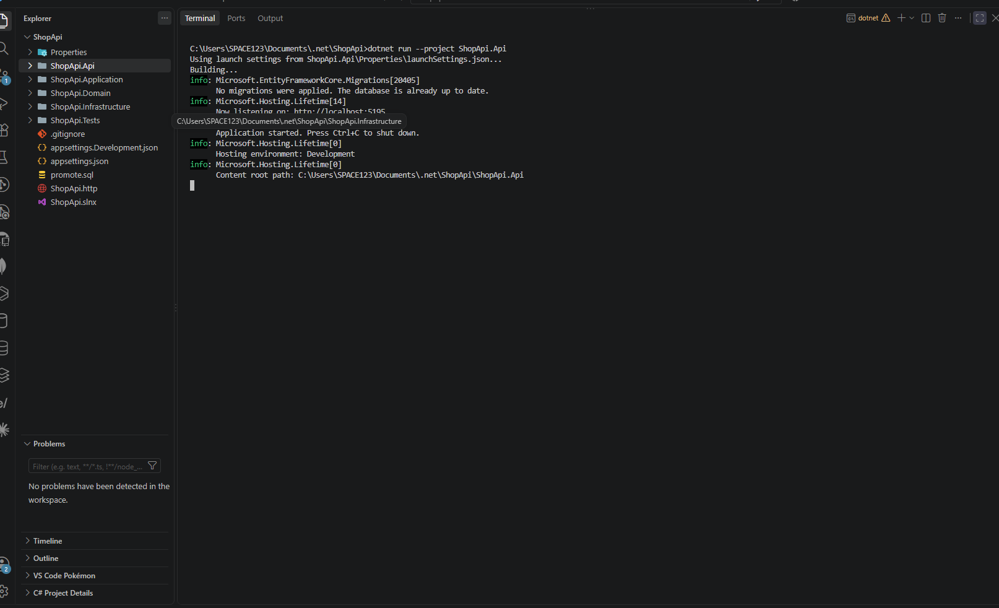
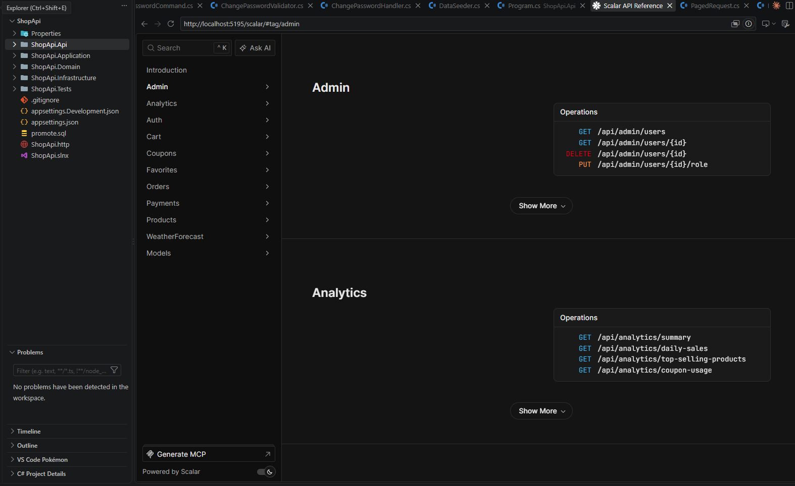
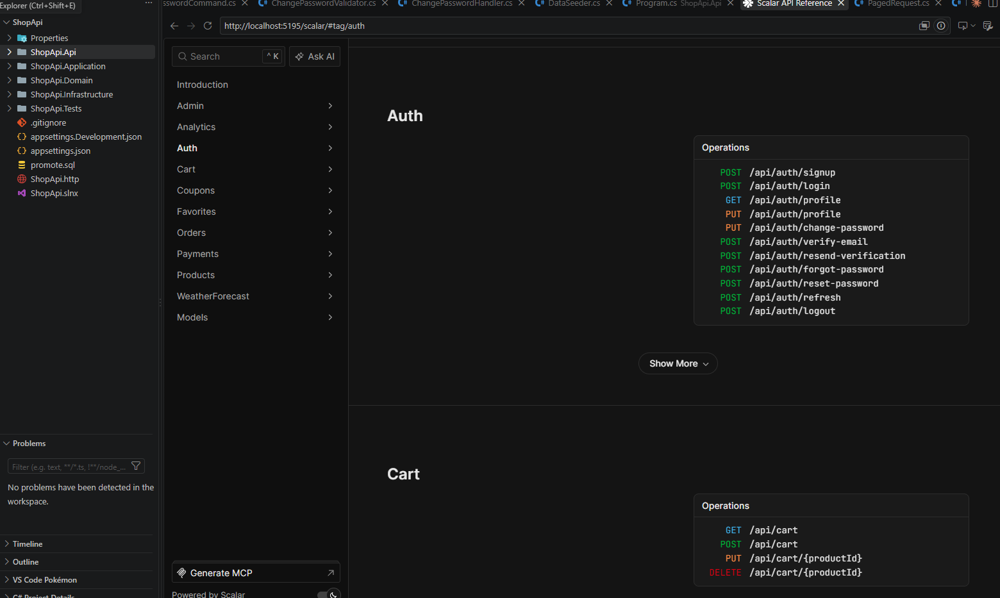
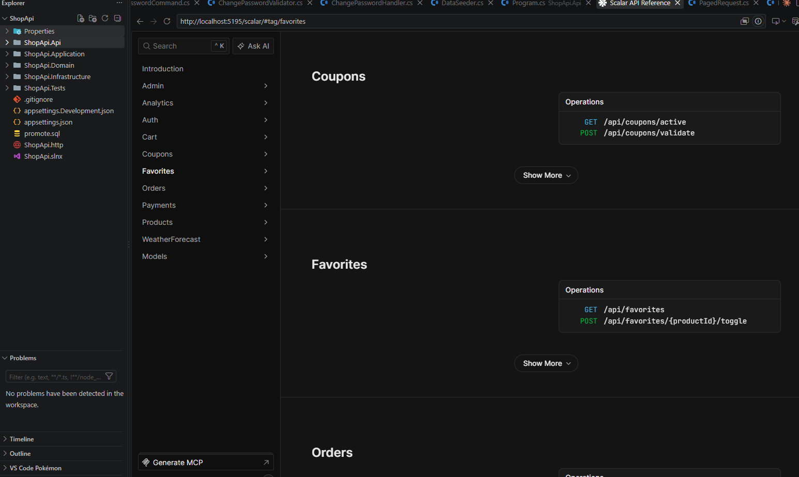
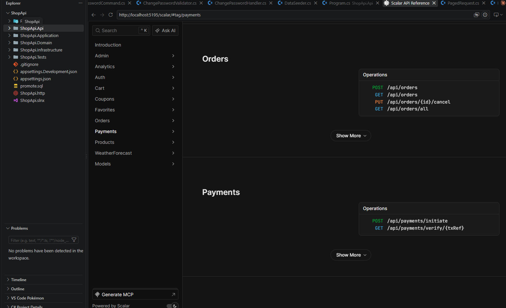
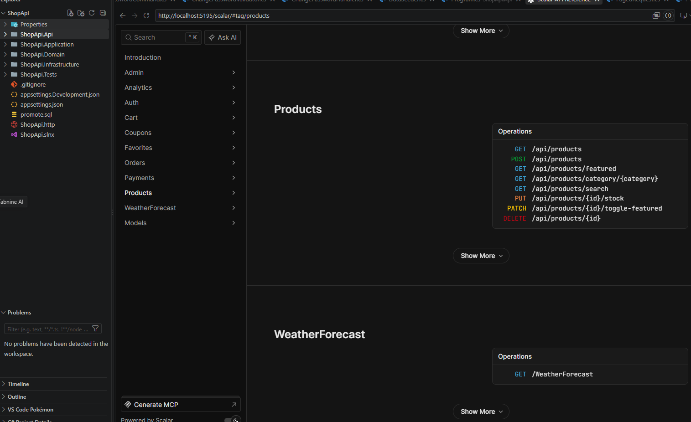

# ShopApi — E-Commerce REST API

A clean architecture ASP.NET Core 10 REST API for an e-commerce platform. Supports authentication, product management, cart, orders, payments, coupons, favorites, and analytics.

---

## 📸 API Screenshots

### API Running


### Admin & Analytics


### Auth & Cart


### Coupons & Favorites


### Orders & Payments


### Products


---

## 🛠️ Tech Stack

| Concern      | Technology                   |
|--------------|------------------------------|
| Framework    | ASP.NET Core 10              |
| Language     | C#                           |
| Architecture | Clean Architecture / CQRS    |
| ORM          | Entity Framework Core        |
| Database     | PostgreSQL                   |
| Caching      | Redis                        |
| Messaging    | MediatR                      |
| Validation   | FluentValidation             |
| Auth         | JWT Bearer + Refresh Tokens  |
| Payment      | Chapa Payment Gateway        |
| Storage      | Cloudinary                   |
| Email        | SMTP / Fake Email Service    |
| API Docs     | Scalar (OpenAPI)             |
| Testing      | xUnit                        |

---

## 📁 Project Structure

```
ShopApi/
│   .gitignore
│   appsettings.json
│   appsettings.Development.json
│   ShopApi.slnx
│   ShopApi.http
│
├── docs/
│   └── screenshots/
│           api-running.png
│           scalar-admin-analytics.png
│           scalar-auth-cart.png
│           scalar-coupons-favorites.png
│           scalar-orders-payments.png
│           scalar-products.png
│
├── ShopApi.Api/
│   │   Program.cs
│   │   ShopApi.Api.csproj
│   │
│   ├── Auth/
│   │       CookieAuthOptions.cs
│   │
│   ├── Controllers/
│   │       AdminController.cs
│   │       AnalyticsController.cs
│   │       AuthController.cs
│   │       CartController.cs
│   │       CouponsController.cs
│   │       FavoritesController.cs
│   │       OrdersController.cs
│   │       PaymentsController.cs
│   │       ProductsController.cs
│   │
│   ├── ExceptionHandlers/
│   │       GlobalExceptionHandler.cs
│   │
│   ├── Middleware/
│   │       RequestLoggingMiddleware.cs
│   │
│   └── Options/
│           ChapaOptions.cs
│           CloudinaryOptions.cs
│           RedisOptions.cs
│
├── ShopApi.Application/
│   │   ShopApi.Application.csproj
│   │
│   ├── Admin/
│   │   ├── Commands/
│   │   │       DeleteUserCommand.cs
│   │   │       UpdateUserRoleCommand.cs
│   │   ├── Dtos/
│   │   │       UpdateUserRoleRequest.cs
│   │   └── Queries/
│   │           GetAllUsersQuery.cs
│   │           GetUserByIdQuery.cs
│   │
│   ├── Analytics/
│   │   ├── Dtos/
│   │   │       AnalyticsSummaryDto.cs
│   │   │       CouponUsageDto.cs
│   │   │       DailySalesDto.cs
│   │   │       TopSellingProductDto.cs
│   │   └── Queries/
│   │           GetAnalyticsSummaryQuery.cs
│   │           GetCouponUsageQuery.cs
│   │           GetDailySalesQuery.cs
│   │           GetTopSellingProductsQuery.cs
│   │
│   ├── Auth/
│   │   ├── Commands/
│   │   │       LoginCommand.cs
│   │   │       SignupCommand.cs
│   │   │       LogoutCommand.cs
│   │   │       RefreshTokenCommand.cs
│   │   │       ChangePasswordCommand.cs
│   │   │       ForgotPasswordCommand.cs
│   │   │       ResetPasswordCommand.cs
│   │   │       UpdateProfileCommand.cs
│   │   │       VerifyEmailCommand.cs
│   │   │       SendVerificationEmailCommand.cs
│   │   ├── Dtos/
│   │   │       LoginRequest.cs
│   │   │       LoginResponseDto.cs
│   │   │       SignupRequest.cs
│   │   │       UserResponseDto.cs
│   │   │       UpdateProfileRequest.cs
│   │   │       ChangePasswordRequest.cs
│   │   │       ForgotPasswordRequest.cs
│   │   │       ResetPasswordRequest.cs
│   │   └── Queries/
│   │           GetProfileQuery.cs
│   │
│   ├── Behaviors/
│   │       LoggingBehavior.cs
│   │       ValidationBehavior.cs
│   │
│   ├── Cart/
│   │   ├── Commands/
│   │   │       AddToCartCommand.cs
│   │   │       RemoveFromCartCommand.cs
│   │   │       UpdateCartItemCommand.cs
│   │   ├── Dtos/
│   │   │       CartItemDto.cs
│   │   │       CartResponseDto.cs
│   │   └── Queries/
│   │           GetCartQuery.cs
│   │
│   ├── Common/
│   │       Result.cs
│   │       PagedRequest.cs
│   │       PagedResponse.cs
│   │       AuthError.cs
│   │       CartError.cs
│   │       CouponError.cs
│   │       OrderError.cs
│   │       PaymentError.cs
│   │       ProductError.cs
│   │       FavoriteError.cs
│   │       EmailVerificationError.cs
│   │       PinGenerator.cs
│   │       VerificationEmailTemplate.cs
│   │
│   ├── Coupons/
│   │   ├── Commands/
│   │   │       ValidateCouponCommand.cs
│   │   ├── Dtos/
│   │   │       CouponResponseDto.cs
│   │   └── Queries/
│   │           GetActiveCouponQuery.cs
│   │
│   ├── Favorites/
│   │   ├── Commands/
│   │   │       ToggleFavoriteCommand.cs
│   │   ├── Dtos/
│   │   │       FavoriteResponseDto.cs
│   │   └── Queries/
│   │           GetFavoritesQuery.cs
│   │
│   ├── Interfaces/
│   │       IUserRepository.cs
│   │       IProductRepository.cs
│   │       ICartRepository.cs
│   │       IOrderRepository.cs
│   │       ICouponRepository.cs
│   │       IFavoriteRepository.cs
│   │       IAnalyticsRepository.cs
│   │       ITokenService.cs
│   │       IPasswordHasher.cs
│   │       IEmailService.cs
│   │       ICloudinaryService.cs
│   │       IChapaPaymentService.cs
│   │       ICachedProductService.cs
│   │       IRefreshTokenStore.cs
│   │
│   ├── Orders/
│   │   ├── Commands/
│   │   │       CreateOrderCommand.cs
│   │   │       CancelOrderCommand.cs
│   │   ├── Dtos/
│   │   │       OrderItemDto.cs
│   │   │       OrderResponseDto.cs
│   │   └── Queries/
│   │           GetAllOrdersQuery.cs
│   │           GetUserOrdersQuery.cs
│   │
│   ├── Payments/
│   │   ├── Commands/
│   │   │       InitiatePaymentCommand.cs
│   │   │       ConfirmPaymentCommand.cs
│   │   │       VerifyCheckoutCommand.cs
│   │   └── Dtos/
│   │           InitiatePaymentRequest.cs
│   │
│   └── Products/
│       ├── Commands/
│       │       CreateProductCommand.cs
│       │       DeleteProductCommand.cs
│       │       ToggleFeaturedCommand.cs
│       │       UpdateStockCommand.cs
│       ├── Dtos/
│       │       CreateProductRequest.cs
│       │       ProductResponseDto.cs
│       │       UpdateStockRequest.cs
│       └── Queries/
│               GetAllProductsQuery.cs
│               GetFeaturedProductsQuery.cs
│               GetProductsByCategoryQuery.cs
│               GetRecommendedProductsQuery.cs
│               SearchProductsQuery.cs
│
├── ShopApi.Domain/
│   │   ShopApi.Domain.csproj
│   │
│   └── Entities/
│           User.cs
│           Product.cs
│           Order.cs
│           OrderItem.cs
│           CartItem.cs
│           Coupon.cs
│           Favorite.cs
│           RefreshToken.cs
│
├── ShopApi.Infrastructure/
│   │   ShopApi.Infrastructure.csproj
│   │
│   ├── Auth/
│   │       TokenService.cs
│   │       PasswordHasher.cs
│   │       EfRefreshTokenStore.cs
│   │       RedisRefreshTokenStore.cs
│   │
│   ├── BackgroundJobs/
│   │       RefreshTokenCleanupService.cs
│   │
│   ├── Caching/
│   │       CachedProductService.cs
│   │       CacheKeys.cs
│   │
│   ├── Migrations/
│   │       20260723080304_InitialCreate.cs
│   │       20260723125105_AddEntityConfigurations.cs
│   │       20260725140221_AddOrderCouponCode.cs
│   │       20260726191258_AddEmailVerification.cs
│   │       20260801192649_AddRefreshTokens.cs
│   │       ShopDbContextModelSnapshot.cs
│   │
│   ├── Persistence/
│   │   │   ShopDbContext.cs
│   │   │   DataSeeder.cs
│   │   │
│   │   ├── Configurations/
│   │   │       UserConfiguration.cs
│   │   │       ProductConfiguration.cs
│   │   │       OrderConfiguration.cs
│   │   │       OrderItemConfiguration.cs
│   │   │       CartItemConfiguration.cs
│   │   │       CouponConfiguration.cs
│   │   │       FavoriteConfiguration.cs
│   │   │       RefreshTokenConfiguration.cs
│   │   │
│   │   └── Repositories/
│   │           UserRepository.cs
│   │           ProductRepository.cs
│   │           OrderRepository.cs
│   │           CartRepository.cs
│   │           CouponRepository.cs
│   │           FavoriteRepository.cs
│   │           AnalyticsRepository.cs
│   │
│   └── Services/
│       │   EmailService.cs
│       │   FakeEmailService.cs
│       │   ChapaPaymentService.cs
│       │   FakeChapaPaymentService.cs
│       │   CloudinaryService.cs
│       │
│       └── EmailTemplates/
│               BaseTemplate.cs
│               AccountCreatedTemplate.cs
│               ApprovalEmailTemplate.cs
│               RejectionEmailTemplate.cs
│               TempPasswordTemplate.cs
│
└── ShopApi.Tests/
    │   ShopApi.Tests.csproj
    │
    ├── Cart/
    └── Products/
```

---

## ✨ Features

### Authentication
- JWT Bearer token authentication
- Refresh token support (EF Core + Redis)
- Email verification with PIN
- Forgot / reset password flow
- Role-based access control (Admin / Customer)
- Background job for refresh token cleanup

### Products
- Create, delete, toggle featured
- Update stock
- Search and filter by category
- Recommended and featured products
- Redis caching layer

### Cart
- Add, remove, update cart items
- Per-user cart management

### Orders
- Create and cancel orders
- Admin view of all orders
- User order history

### Payments
- Chapa payment gateway integration
- Initiate, confirm, and verify checkout
- Fake payment service for testing

### Coupons
- Validate and apply coupons
- Coupon usage analytics

### Favorites
- Toggle favorites per user
- Get user favorites list

### Analytics
- Sales summary
- Daily sales data
- Top selling products
- Coupon usage stats

---

## 🚀 Getting Started

### Prerequisites
- .NET 10 SDK
- PostgreSQL
- Redis

### 1. Clone the repository

```bash
git clone <https://github.com/codewithyusa/ShopApi.git>
cd ShopApi
```

### 2. Configure settings

Update `appsettings.Development.json`:

```json
{
  "ConnectionStrings": {
    "DefaultConnection": "Host=localhost;Database=shopdb;Username=postgres;Password=password"
  },
  "Redis": {
    "ConnectionString": "localhost:6379"
  },
  "Jwt": {
    "Key": "your-secret-key",
    "Issuer": "ShopApi",
    "Audience": "ShopApi"
  },
  "Chapa": {
    "SecretKey": "your-chapa-key"
  },
  "Cloudinary": {
    "CloudName": "",
    "ApiKey": "",
    "ApiSecret": ""
  }
}
```

### 3. Apply migrations

```bash
dotnet ef database update --project ShopApi.Infrastructure --startup-project ShopApi.Api
```

### 4. Run the API

```bash
dotnet run --project ShopApi.Api
```

API available at `http://localhost:5195`

Scalar API docs at `http://localhost:5195/scalar`

---

## 🧪 Testing

```bash
dotnet test
```

---

## 📡 API Endpoints

### Auth
| Method | Endpoint | Description |
|--------|----------|-------------|
| POST | `/api/auth/signup` | Register |
| POST | `/api/auth/login` | Login |
| GET | `/api/auth/profile` | Get profile |
| PUT | `/api/auth/profile` | Update profile |
| PUT | `/api/auth/change-password` | Change password |
| POST | `/api/auth/verify-email` | Verify email |
| POST | `/api/auth/forgot-password` | Forgot password |
| POST | `/api/auth/reset-password` | Reset password |
| POST | `/api/auth/refresh` | Refresh token |
| POST | `/api/auth/logout` | Logout |

### Products
| Method | Endpoint | Description |
|--------|----------|-------------|
| GET | `/api/products` | Get all products |
| POST | `/api/products` | Create product (Admin) |
| GET | `/api/products/featured` | Get featured products |
| GET | `/api/products/category/{category}` | Filter by category |
| GET | `/api/products/search` | Search products |
| PUT | `/api/products/{id}/stock` | Update stock (Admin) |
| PATCH | `/api/products/{id}/toggle-featured` | Toggle featured (Admin) |
| DELETE | `/api/products/{id}` | Delete product (Admin) |

### Cart
| Method | Endpoint | Description |
|--------|----------|-------------|
| GET | `/api/cart` | Get cart |
| POST | `/api/cart` | Add to cart |
| PUT | `/api/cart/{productId}` | Update cart item |
| DELETE | `/api/cart/{productId}` | Remove from cart |

### Orders
| Method | Endpoint | Description |
|--------|----------|-------------|
| POST | `/api/orders` | Create order |
| GET | `/api/orders` | Get user orders |
| GET | `/api/orders/all` | Get all orders (Admin) |
| PUT | `/api/orders/{id}/cancel` | Cancel order |

### Payments
| Method | Endpoint | Description |
|--------|----------|-------------|
| POST | `/api/payments/initiate` | Initiate payment |
| GET | `/api/payments/verify/{txRef}` | Verify payment |

### Coupons
| Method | Endpoint | Description |
|--------|----------|-------------|
| GET | `/api/coupons/active` | Get active coupons |
| POST | `/api/coupons/validate` | Validate coupon |

### Favorites
| Method | Endpoint | Description |
|--------|----------|-------------|
| GET | `/api/favorites` | Get favorites |
| POST | `/api/favorites/{productId}/toggle` | Toggle favorite |

### Admin
| Method | Endpoint | Description |
|--------|----------|-------------|
| GET | `/api/admin/users` | Get all users |
| GET | `/api/admin/users/{id}` | Get user by ID |
| DELETE | `/api/admin/users/{id}` | Delete user |
| PUT | `/api/admin/users/{id}/role` | Update user role |

### Analytics
| Method | Endpoint | Description |
|--------|----------|-------------|
| GET | `/api/analytics/summary` | Sales summary |
| GET | `/api/analytics/daily-sales` | Daily sales |
| GET | `/api/analytics/top-selling-products` | Top products |
| GET | `/api/analytics/coupon-usage` | Coupon usage |

---

## 🏗️ Architecture

This project follows **Clean Architecture** with CQRS via MediatR:

- **Domain** — Entities only, no dependencies
- **Application** — Business logic, commands, queries, interfaces
- **Infrastructure** — EF Core, repositories, services, external APIs
- **Api** — Controllers, middleware, options, entry point

---

## 📄 License

School project — CoTBE Software Engineering Programme 2026.